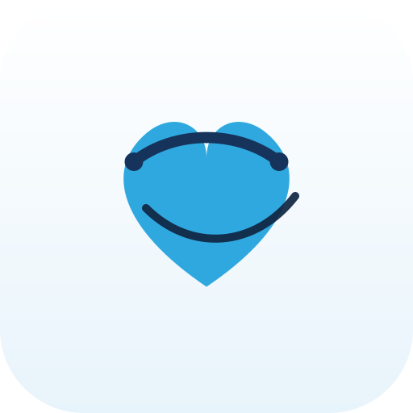
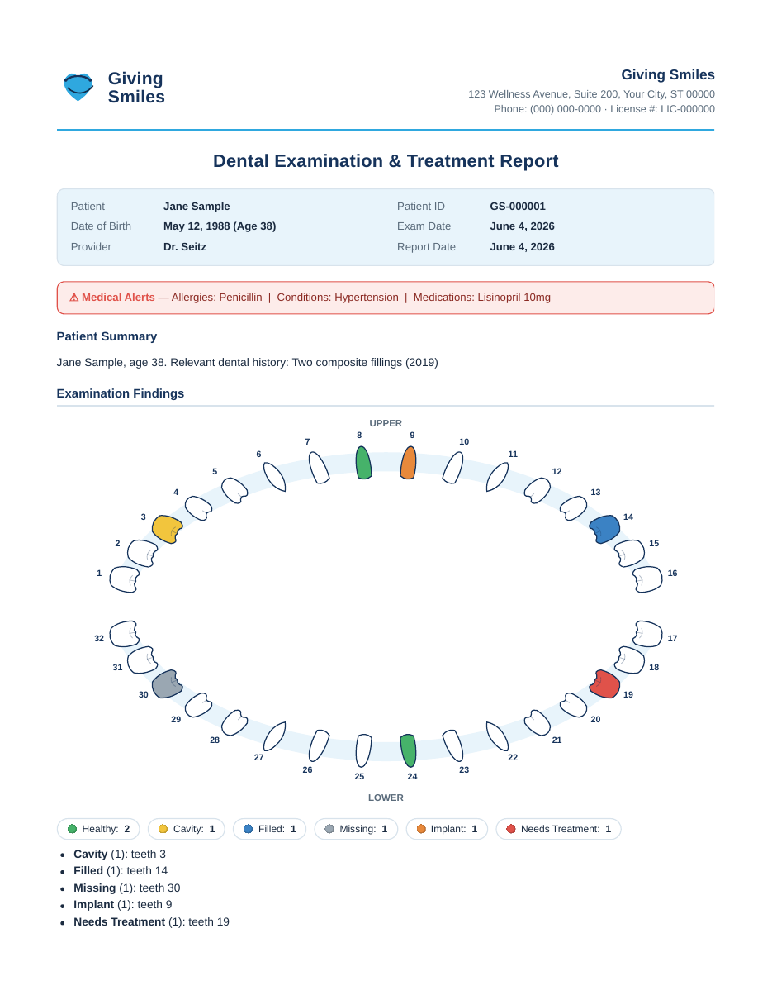
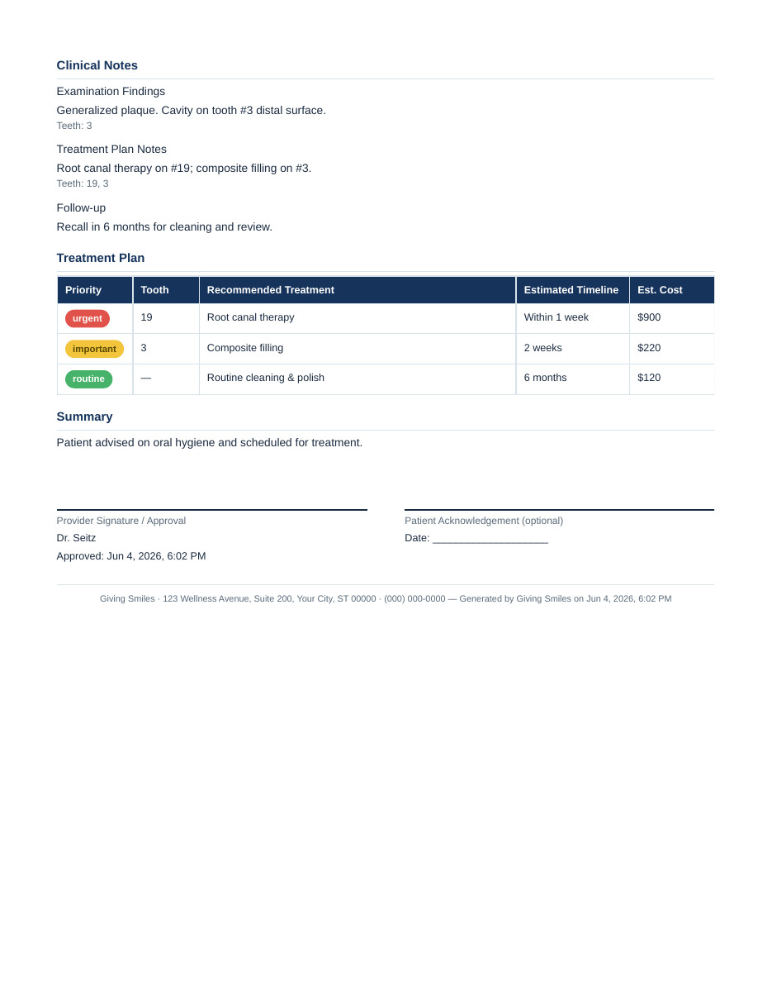
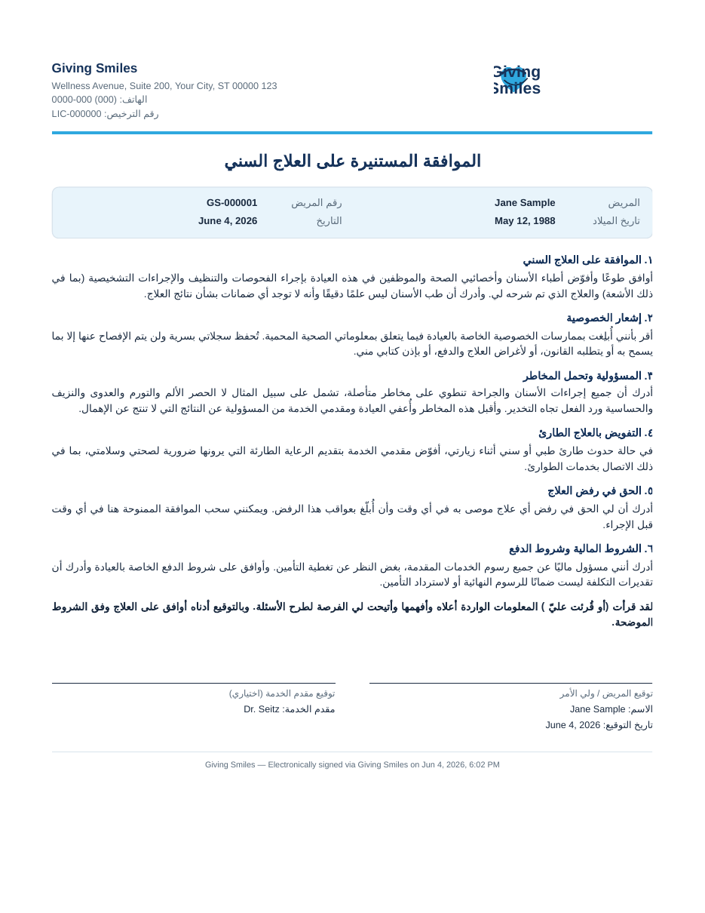

<div align="center">
  
  <h1>Giving Smiles — Dental Clinic Management</h1>
  <p>A professional offline Windows desktop application for patient intake, digital consent, clinical examinations with an interactive tooth chart, and automated, printable treatment reports.</p>
</div>

---

## What this is

**Giving Smiles** is a complete, offline-first desktop app for a single dental clinic. It runs as a real **Windows application** you install on your clinic computers — no internet, no cloud, no monthly fees. All patient data stays on the clinic computer in a local database.

It implements the full clinical workflow: **Intake → Consent (signed) → Examination (tooth chart + notes) → Treatment Report (print / email / save)**.

| Treatment report (page 1) | Treatment report (page 2) | Consent — Arabic (RTL) |
|---|---|---|
|  |  |  |

## Key features

- **Patient intake** — full medical/dental history, auto-generated Patient ID, draft auto-save, search.
- **Digital consent forms** in **English, Spanish, and Arabic** (RTL) with on-screen signature capture, embedded into a professional PDF and archived to the patient record.
- **Patient record dashboard** — medical alerts, history, documents, exams, and images in tabs.
- **Interactive tooth chart** — 32 anatomically-shaped teeth laid out as a real dental arch (a "build of the mouth", not squares). Click to set condition, surfaces, and notes; quick-paint mode; live counts; color-coded legend.
- **Clinical notes** — typed findings/treatment-plan/follow-up notes with auto-save and tooth links.
- **Treatment plan** — prioritised (urgent / important / routine) items with timeline and cost.
- **Treatment report** — auto-generated, professional PDF embedding the tooth chart. **Prints reliably** (uses the OS print pipeline), **exports to PDF**, and **emails** to the patient.
- **Patient Check-In (kiosk)** — a clean full-screen, patient-facing intake + consent flow you can hand to a patient on a clinic touchscreen (this is the "front-facing form").
- **Accounts & security** — three roles, bcrypt-hashed passwords, 30-minute inactivity auto-logout, activity log.
- **Settings** — clinic info, optional SMTP for one-click report emailing, user management, and database backup.

### New in v1.1.0
- **Treatment reports in the patient's language** — headings/labels render in English, Spanish, or Arabic (RTL) based on the patient's preference. Your typed notes stay exactly as written. Fully offline.
- **Read consent aloud** — a button reads the consent form using the computer's built-in voice (offline; Spanish/Arabic use Windows language voices if installed).
- **Translated Check-In** — the patient kiosk form (labels + common allergy/condition picks) appears in the patient's chosen language; the doctor portal stays English.
- **Quick-pick medical history** — common allergies & conditions as one-tap chips, with an "Other" box; medications stay free-text.
- **Tooth chart "mark all, then work backwards"** — set every tooth to one condition (e.g. Healthy) and change only the exceptions.
- **Quick-delete a patient** (Doctor/Admin) — removes the record; signed PDFs stay archived on disk.
- **Version number** shown at the bottom of the sidebar; simplified Dental section (Referring Doctor & Insurance removed).

### New in v1.1.1
- **Voice typing (offline)** — a 🎤 Dictate button in Clinical Notes, Treatment Plan, and the Report summary focuses the field and lets you dictate with your computer's built-in voice typing (Windows **Win + H**). No internet, and nothing leaves the computer.

### New in v1.2.0
- **Events (per-event patient grouping)** — admins create an event (name, location, date); set one **active** and every new check-in (front desk or tablet) is auto-tagged to it. Filter patients by event, change a patient's event on their record, and **Export Event Folder** copies all tagged patients' files + a roster CSV into one folder (USB, etc.).
- **Tablet check-in over local network** — Settings → *Tablet Check-In* starts a small on-device server; a tablet on the **same wifi/hotspot (no internet)** opens the link or scans the QR code, the patient completes intake + consent + signature, and they appear in the app instantly with a signed consent.
- **Referral templates** — admins/doctors create reusable referral letters per receiving clinic (Settings → *Referral Templates*); generate a referral from any patient record and **print or email** it (auto-pulls medical alerts + latest findings, optional tooth-chart image).
- **Extraction tooth condition** — a new purple **Extraction** status on the tooth chart, included in the legend, counts, and translated reports.

### New in v1.2.1
- **Auto-update** — *Settings → Software Updates* (admin) checks this repo's releases, downloads the new version with a progress bar, and installs in place with **Restart & Install** — no more manual re-downloads. A quiet check also runs at startup (offline clinics are unaffected; patient data is never touched by updates).

### New in v1.2.2
- **Show password** toggle on the sign-in screen.
- **Delete events** directly (admin) — from the Events page you can now delete an event outright; its patients are kept and simply untagged (records and files untouched), so you're no longer limited to archiving.

### New in v1.2.3
- **Single bootstrap admin** — a fresh install now starts with one generic `admin` / `admin123` login; the login screen no longer shows any credentials. Create your own staff logins from Settings → User Management and change the password.
- **Activity log management** (admin) — **Download CSV** and **Clear Log** buttons in Settings.
- **Trademark / legal** — *Giving Smiles™ — © 2026 Software Smiles* notices added to the app, the PDF documents, and the installer metadata.

## Sign-in accounts

A fresh install bootstraps with a **single administrator** account:

| Username | Password | Role |
|---|---|---|
| `admin` | `admin123` | **Administrator** |

Sign in as `admin`, then create your clinic's own staff logins (doctor / front desk) and change the admin password from **Settings → User Management** and **Settings → Change My Password**. *(Already-installed machines keep whatever accounts they already had — this only applies to fresh installs.)*

## Getting the Windows app

**⬇️ Permanent download link (always the newest version):**
**https://github.com/oofski/DentalClinicCRM/releases/latest/download/GivingSmiles-Setup.exe**
(portable: `…/releases/latest/download/GivingSmiles-Portable.exe`)

You don't build anything by hand. There are two ways to get the installer:

### Option A — Download the pre-built installer (recommended)
This repository includes a GitHub Actions workflow that builds the Windows installer automatically.
1. In GitHub, open the **Actions** tab → **Build Windows Installer** → the most recent run.
2. Download the **`GivingSmiles-Windows`** artifact (a zip).
3. Inside you'll find **`GivingSmiles-Setup.exe`** (installer) and a portable `.exe`.
4. Copy the installer to each clinic computer and run it. (Windows SmartScreen may warn about an unsigned app — choose *More info → Run anyway*. See [BUILD_AND_INSTALL.md](BUILD_AND_INSTALL.md) about code signing.)

### Option B — Build it yourself on a Windows PC
```bat
npm install
npm run dist:win
```
The installer appears in `release\<version>\`. Full steps in **[BUILD_AND_INSTALL.md](BUILD_AND_INSTALL.md)**.

## Running in development

```bash
npm install
npm run dev        # launches the app with hot reload
```

Useful scripts: `npm run build` (compile), `npm run typecheck`, `npm run dist:win` (Windows installer), `npm run dist:linux` (AppImage, for testing).

## Where data is stored

Everything is local to the clinic computer — **no data ever leaves the machine** (unless you explicitly email a report):

```
%APPDATA%\giving-smiles\GivingSmilesData\
├── givingsmiles.db            ← SQLite database (patients, exams, notes, users…)
└── PatientFiles\<Patient ID>\
    ├── Consents\              ← signed consent PDFs
    ├── Reports\               ← treatment report PDFs
    └── Images\                ← uploaded X-rays / photos
```

Back up the database any time from **Settings → Data & Backup → Back Up Database…**.

## Customising for your clinic

- **Clinic name / address / phone / license #** → Settings → Clinic Information (these appear on every form and report).
- **Consent wording** → edit `shared/consent.ts` (English/Spanish/Arabic). *Have your legal counsel review the consent language before use — the included text is a professional starting point, not legal advice.*
- **Email delivery** → Settings → Email Delivery. Leave blank to use the offline default (opens your mail app and reveals the PDF to attach), or enter SMTP details to email reports directly with the attachment.
- **Logo** → recreated in `shared/branding.ts` and `resources/icon.svg`.

## Architecture (for the maintaining developer)

- **Electron + React + TypeScript**, bundled with **electron-vite**, packaged with **electron-builder** (NSIS installer + portable).
- **Database:** SQLite via **sql.js** (WebAssembly — no native modules, so the Windows build is reliable). Synchronous write-through persistence with atomic file replace.
- **Main process** (`electron/main/`): database, repositories, auth (bcryptjs), file storage, PDF/print engine, email, and all IPC handlers.
- **Renderer** (`src/`): React UI, routed with React Router (`HashRouter`).
- **Shared** (`shared/`): types, dental reference data, consent content, branding, and the tooth-chart geometry/SVG — used by both the interactive chart and the printed report so they always match.
- **PDF & printing:** documents are rendered as HTML and converted via Electron's own print engine — `printToPDF()` for export/email and the system print dialog for physical printing, which is why printing is reliable across printers.
- **Security:** `contextIsolation` on, `nodeIntegration` off, a typed `contextBridge` preload, a restricted `gsmedia://` protocol for serving patient images, and a strict CSP.

See `electron/main/index.ts` (app entry), `electron/main/ipc.ts` (API surface), and `src/components/ToothChart.tsx` (the chart).
